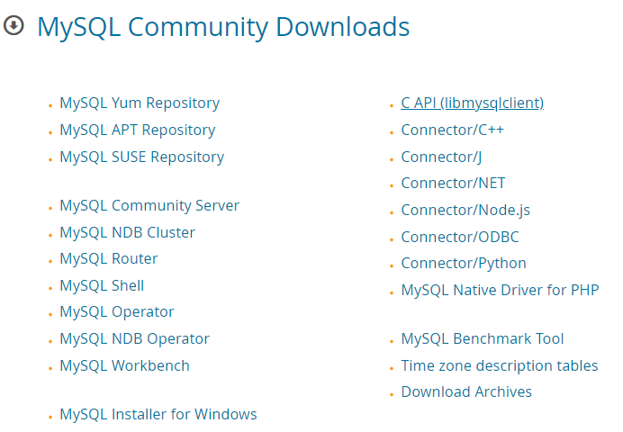
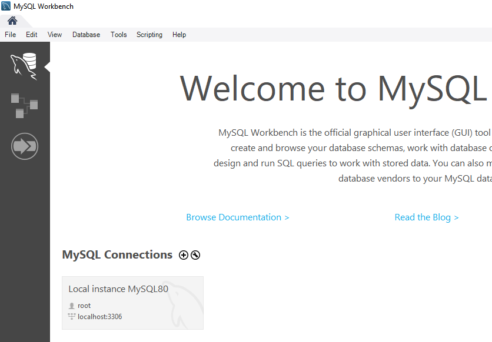
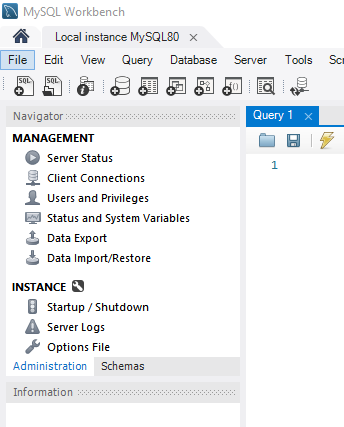
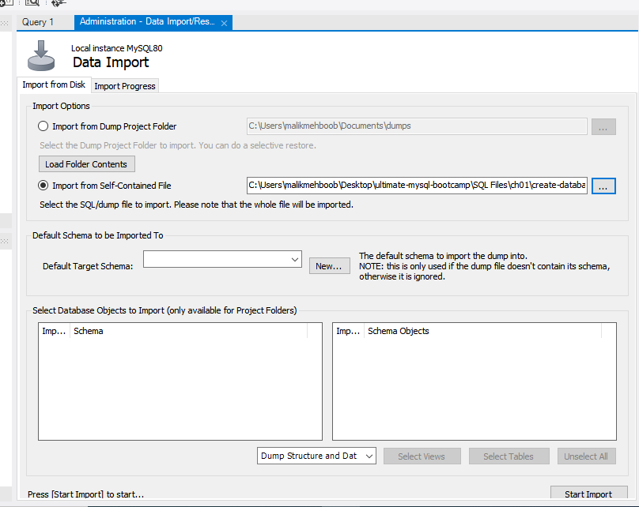
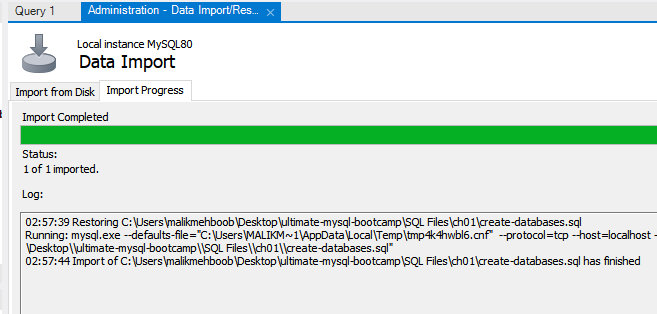
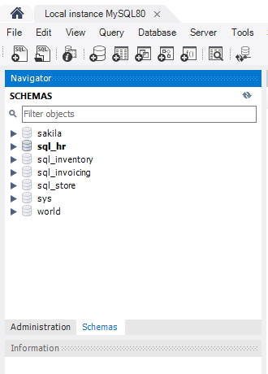
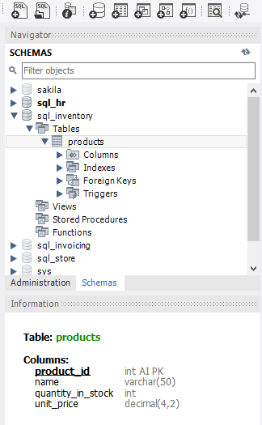
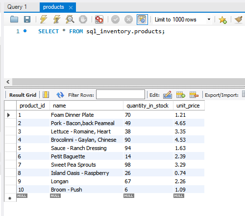

## How to Import Database Into `MYSQL`

- Importing a database into MySQL is a straightforward process. 

- Here's a step-by-step guide:

1. **Ensure MySQL is Installed**: 
- First, make sure you have MySQL installed on your computer. 
- You can download and install MySQL from the official website [Download](https://dev.mysql.com/downloads/).
- Now `Select` the `MYSQL installer for windows`.

</img>

2. **Start MySQL Server**: 
- If MySQL server is not running, start it. 
- You can start MySQL server using the command line or through the MySQL Workbench if you have it installed.

3. Then you will open the main `MYSQL Workbench` and click the `local instance` tab under the MYSQL       connections.

</img>

## Import the database:
- Now,In the `Local instance` tab.
- Go to the `management` section.
- And on the sixth line you will find the `Data Import/Restore` option.
- Now `Select` it.

</img>

 - Now an `Data Import` screen will be shown.
 - `Click` the `Import from self-contained file`.
 - And `Add` the desire file.
 - Than at the right-bottom ,Click `start import`

</img>

- Now the Data will start to `Import`.

</img>

- After the Data is Imported.
- At the left-bottom there will be a `Schemas` click it.
- Now you will see the `Database` in that section.

</img>

4. **Verify the import**: Once the import process is complete, you can verify that the database has been  imported successfully. 

</img>

- Now you can add any `Table` from any `Database`.

</img>

- That's it! You have successfully imported your database into MySQL. 

