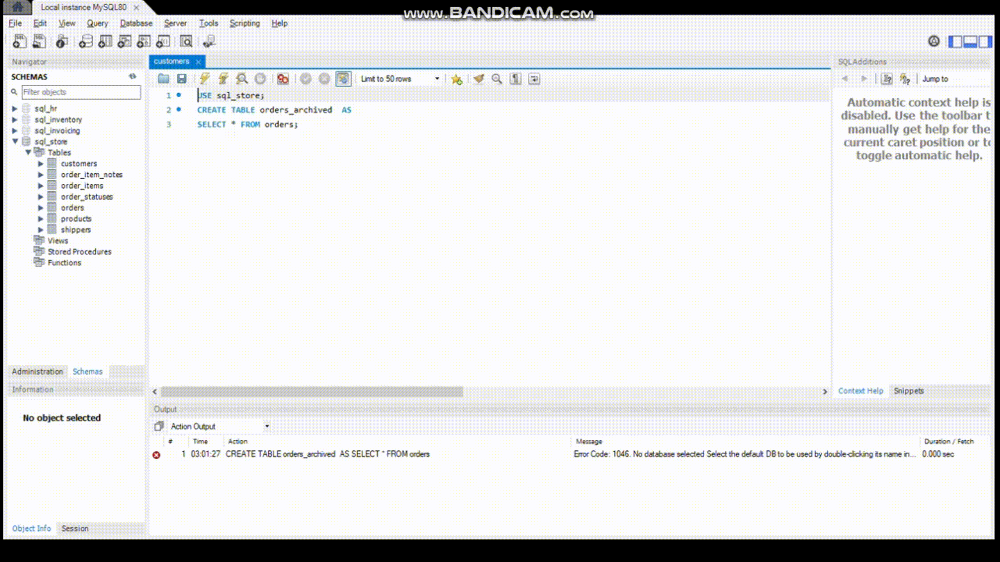

### Creating Copy of a Table

- Creating a copy of a table in a database essentially duplicates the structure and data of the original table, resulting in a new table with identical schema and contents. This operation is commonly used for various purposes such as backup, data migration, or performing experimental changes without affecting the original table.

- When you create a copy of a table, you essentially replicate both the structure (columns, data types, constraints, etc.) and the data itself. This means that the new table will have the same columns, indexes, and constraints as the original table, and it will contain a copy of all the rows from the original table at the time the copy was made.

- Here's how you typically create a copy of a table in SQL:

```sql
CREATE TABLE orders_archived  AS
SELECT * FROM orders;
```

* `new_table_name`: The name of the new table that will be created as a copy of the original table.
* `original_table_name`: The name of the existing table that you want to copy.

- This statement creates a new table (`new_table_name`) with the same structure and data as the original table (`original_table_name`). All columns and rows from the original table are copied to the new table.
<hr>



<hr>