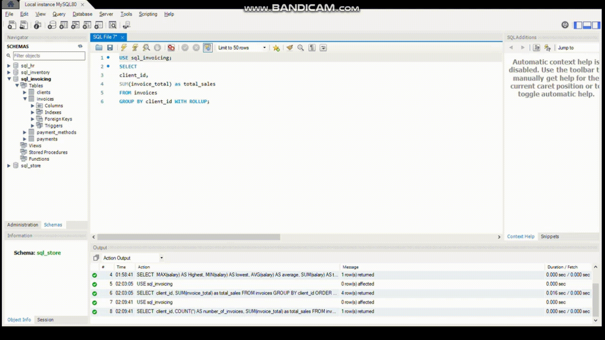

### **ROLL UP** Operator:

- `ROLLUP` is an extension of the `GROUP BY` clause in SQL that is used to generate subtotals for groups of rows. It produces multiple grouping sets based on the columns specified in the `GROUP BY` clause, providing a hierarchical view of aggregated data.

- Here's what `ROLLUP` does:

- **Generates Subtotals**: It generates subtotals for multiple levels of aggregation based on the columns specified in the `GROUP BY` clause.

- **Hierarchy of Subtotals**: `ROLLUP` generates subtotals for each combination of columns specified in the `GROUP BY` clause, from the most detailed level to the grand total level.

- **Grand Total**: In addition to the subtotals, `ROLLUP` also computes the grand total for all rows in the result set.

```sql
USE sql_invoicing;
SELECT 
client_id,
SUM(invoice_total) as total_sales
FROM invoices
GROUP BY client_id WITH ROLLUP;
```

<hr>



<hr>