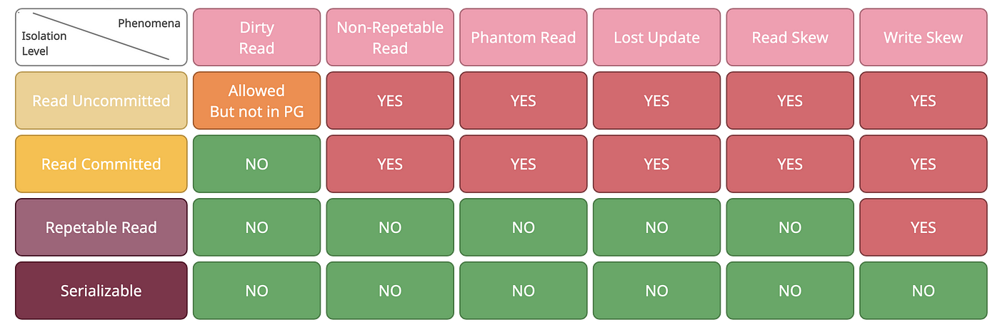

# Transaction Isolation Levels
### Introduction
Transaction isolation levels define how transactions interact with each other in a multi-user database environment. They control the visibility of changes made by concurrent transactions, ensuring data consistency and integrity. MySQL supports various isolation levels, each offering different guarantees regarding data visibility, concurrency, and performance.

### Types of Isolation Levels
MySQL supports the following transaction isolation levels, listed in order of increasing strictness:

* `READ UNCOMMITTED:` Allows transactions to read uncommitted changes made by other transactions, leading to potential dirty reads, non-repeatable reads, and phantom reads.

* `READ COMMITTED:` Ensures that transactions only see committed changes made by other transactions, preventing dirty reads but allowing non-repeatable reads and phantom reads.

* `REPEATABLE READ:` Guarantees that transactions see a consistent snapshot of the database as it existed at the start of the transaction, preventing dirty reads and non-repeatable reads but allowing phantom reads.

* `SERIALIZABLE:` Provides the highest level of isolation by ensuring that transactions are serialized, i.e., executed one after another in sequence, preventing all concurrency issues but potentially leading to increased contention and performance degradation.

### Isolation Level Characteristics
Each isolation level offers different characteristics regarding data visibility, concurrency, and performance:

* `Dirty Reads:` Whether transactions can read uncommitted changes made by other transactions.

* `Non-Repeatable Reads:` Whether transactions may see different values for the same data within the same transaction due to changes made by other transactions.

* `Phantom Reads:` Whether transactions may see additional rows inserted or deleted by other transactions within the same transaction.



### Setting Isolation Levels
You can set the transaction isolation level in MySQL using the SET TRANSACTION ISOLATION LEVEL statement:

```sql
SHOW VARIABLES LIKE 'transaction_isolation';
SET SESSION TRANSACTION ISOLATION LEVEL SERIALIZABLE;
```
You can also set the isolation level for individual transactions using the START TRANSACTION statement with the appropriate isolation level specified:

### Considerations and Best Practices
* Choose the appropriate isolation level based on the concurrency requirements and consistency guarantees of your application.

* Consider the trade-offs between data consistency, concurrency, and performance when selecting an isolation level.

* Test your application under realistic workload scenarios to evaluate the impact of different isolation levels on performance and data integrity.

* Monitor database performance and adjust isolation levels as needed to optimize performance and ensure data consistency.

<div style="display: flex; align-items: center; align-self: center; justify-content: space-evenly;" align="center">
<a href="../03_concurrency_problems/"></a>
<a href="../05_read_uncommitted_isolation_level/"></a>
</div>