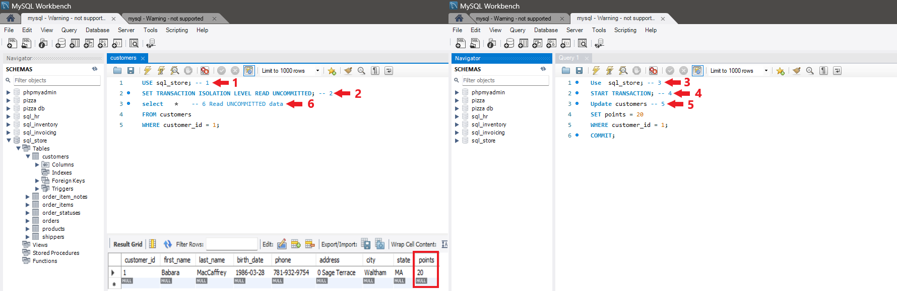

# READ UNCOMMITTED Isolation Level

The READ UNCOMMITTED isolation level, also known as the "dirty read" isolation level, allows transactions to read data that has been modified by other uncommitted transactions. It provides the lowest level of isolation and offers the highest degree of concurrency, as transactions are not blocked by locks held by other transactions. However, READ UNCOMMITTED can lead to data inconsistencies and integrity issues, as transactions may read intermediate or invalid data.

### Characteristics of READ UNCOMMITTED
The READ UNCOMMITTED isolation level in MySQL has the following characteristics:

* `Dirty Reads:` Transactions can read uncommitted changes made by other transactions, potentially leading to inconsistent or invalid data.

* `No Repeatable Reads:` Transactions may see different values for the same data within the same transaction if it has been modified by other transactions.

* `Phantom Reads:` Transactions may see additional rows inserted or deleted by other transactions within the same transaction, leading to inconsistent query results.

### Advantages of READ UNCOMMITTED
The READ UNCOMMITTED isolation level offers the following advantages:

* **High Concurrency:** Allows multiple transactions to read and write data concurrently without being blocked by locks held by other transactions.

* **Low Overhead:** Requires minimal overhead for managing locks and maintaining transaction consistency, resulting in better performance in high-concurrency environments.

### Disadvantages of READ UNCOMMITTED
The READ UNCOMMITTED isolation level has the following disadvantages:

* **Data Inconsistency:** May lead to data inconsistencies and integrity violations, as transactions can read uncommitted changes made by other transactions.

* **Unreliable Results:** Query results may be unpredictable and unreliable, as transactions may see intermediate or invalid data.

### Setting READ UNCOMMITTED Isolation Level
You can set the READ UNCOMMITTED isolation level for a transaction in MySQL using the SET TRANSACTION ISOLATION LEVEL 

Example:
`Run these queries by commited order`
Query box 1
```sql
USE sql_store; --1
SET TRANSACTION ISOLATION LEVEL READ UNCOMMITTED; --2
select * -- 6 Read UNCOMMITTED data 
FROM customers
WHERE customer_id = 1;
```

Query box 2
```sql
Use  sql_store; -- 3
START TRANSACTION; -- 4
Update customers -- 5
SET points = 20
WHERE customer_id = 1;
COMMIT;

```



### Considerations and Best Practices
* **Use with Caution:** Consider the potential risks and consequences of data inconsistencies when using the READ UNCOMMITTED isolation level.

* **Limited Use Cases:** Limit the use of READ UNCOMMITTED to scenarios where data consistency is not critical, and high concurrency is essential.

* **Monitor and Test:** Monitor database performance and behavior under READ UNCOMMITTED isolation and conduct thorough testing to ensure that it meets application requirements.
<div style="display: flex; align-items: center; align-self: center; justify-content: space-evenly;" align="center">
<a href="../04_transaction_isolation_levels/"></a>
<a href="../06_read_committed_isolation_level/"></a>
</div>