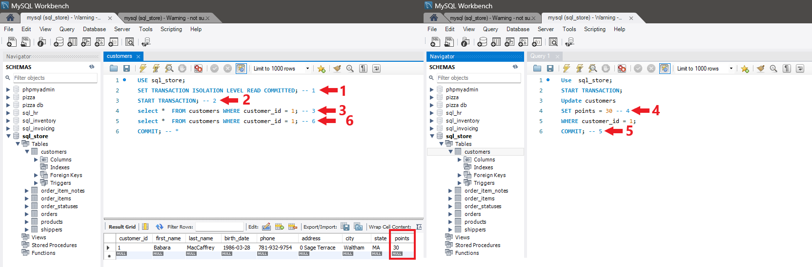

# READ COMMITTED Isolation Level
The READ COMMITTED isolation level in MySQL ensures that transactions only see changes that have been committed by other transactions. It prevents dirty reads by allowing transactions to read only committed data, but it still allows non-repeatable reads and phantom reads. READ COMMITTED provides a balance between data consistency and concurrency, making it suitable for many transactional applications.

### Characteristics of READ COMMITTED
The READ COMMITTED isolation level in MySQL has the following characteristics:

* `No Dirty Reads:` Transactions cannot read uncommitted changes made by other transactions, ensuring data consistency.

* `Non-Repeatable Reads:` Transactions may see different values for the same data within the same transaction if it has been modified by other committed transactions.

* `Phantom Reads:` Transactions may see additional rows inserted or deleted by other committed transactions within the same transaction, leading to inconsistent query results.

### Advantages of READ COMMITTED
The READ COMMITTED isolation level offers the following advantages:

* `Data Consistency:` Prevents dirty reads by ensuring that transactions only see committed changes made by other transactions.

* `Higher Concurrency:` Allows multiple transactions to read and write data concurrently with improved data consistency compared to READ UNCOMMITTED.

### Disadvantages of READ COMMITTED
The READ COMMITTED isolation level has the following disadvantages:

* `Non-Repeatable Reads:` Transactions may still encounter non-repeatable reads, where the same data is read multiple times within the same transaction, but the values change between reads.

* `Phantom Reads:` Transactions may still encounter phantom reads, where additional rows are inserted or deleted by other committed transactions within the same transaction.

### Setting READ COMMITTED Isolation Level
You can set the READ COMMITTED isolation level for a transaction in MySQL using the SET TRANSACTION ISOLATION LEVEL 

Example:
`Run these queries by commit order`
Qery box 1
```sql
USE sql_store;
SET TRANSACTION ISOLATION LEVEL READ COMMITTED; -- 1
START TRANSACTION; -- 2
select *  FROM customers WHERE customer_id = 1; -- 3
select *  FROM customers WHERE customer_id = 1; -- 6
COMMIT; -- *

```

Qery box 2
```sql
Use  sql_store;
START TRANSACTION; 
Update customers 
SET points = 30 -- 4
WHERE customer_id = 1;
COMMIT; -- 5
```




### Considerations and Best Practices
* **Use by Default:** READ COMMITTED is the default isolation level in many database systems, including MySQL, and is suitable for most transactional applications.

* **Balance Consistency and Concurrency:** Consider the trade-offs between data consistency and concurrency when choosing the READ COMMITTED isolation level for your application.

* **Monitor and Test:** Monitor database performance and behavior under READ COMMITTED isolation and conduct thorough testing to ensure that it meets application requirements.
<div style="display: flex; align-items: center; align-self: center; justify-content: space-evenly;" align="center">
<a href="../05_read_uncommitted_isolation_level/"></a>
<a href="../07_repeatable_read_isolation_level/"></a>
</div>