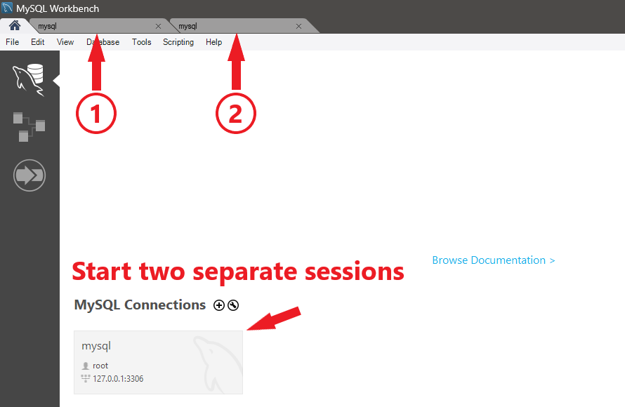
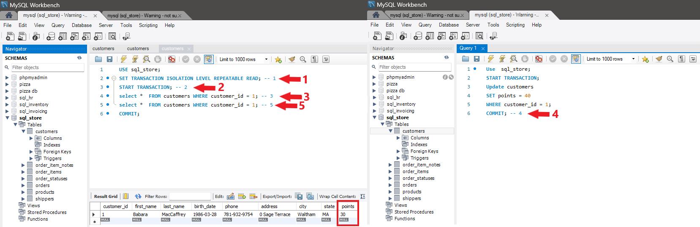
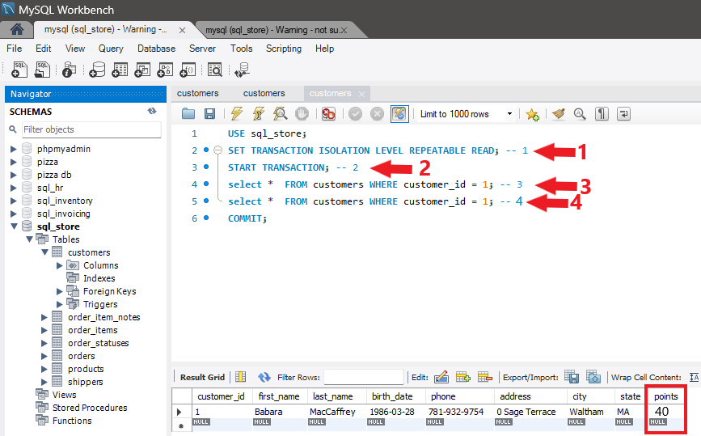

# REPEATABLE READ Isolation Level
The REPEATABLE READ isolation level in MySQL ensures that transactions see a consistent snapshot of the database as it existed at the start of the transaction. It prevents dirty reads and non-repeatable reads by maintaining consistent read consistency throughout the transaction. However, phantom reads may still occur, where additional rows are inserted or deleted by other transactions within the same transaction.

### Characteristics of REPEATABLE READ
The REPEATABLE READ isolation level in MySQL has the following characteristics:

* `No Dirty Reads:` Transactions cannot read uncommitted changes made by other transactions, ensuring data consistency.

* `No Non-Repeatable Reads:` Transactions see the same values for the same data within the same transaction, preventing inconsistencies caused by concurrent updates.

* `Phantom Reads:` Transactions may still encounter phantom reads, where additional rows are inserted or deleted by other transactions within the same transaction.

### Advantages of REPEATABLE READ
The REPEATABLE READ isolation level offers the following advantages:

* **Consistent Snapshot:** Ensures that transactions see a consistent snapshot of the database as it existed at the start of the transaction, preventing inconsistencies caused by concurrent updates.

* **Data Integrity:** Prevents dirty reads and non-repeatable reads, providing a higher level of data integrity compared to READ COMMITTED.

### Disadvantages of REPEATABLE READ
The REPEATABLE READ isolation level has the following disadvantages:

* `Phantom Reads:` Transactions may still encounter phantom reads, where additional rows are inserted or deleted by other transactions within the same transaction.

* `Concurrency Impact:` Maintaining a consistent snapshot for the duration of the transaction may lead to increased contention and performance degradation in high-concurrency environments.

### Setting REPEATABLE READ Isolation Level
You can set the REPEATABLE READ isolation level for a transaction in MySQL using the SET TRANSACTION ISOLATION LEVEL 
Example:

`Run these queries in commited order with two different sessions`

Query box 1
```sql
USE sql_store;
SET TRANSACTION ISOLATION LEVEL REPEATABLE READ; -- 1
START TRANSACTION; -- 2
select *  FROM customers WHERE customer_id = 1; -- 3
select *  FROM customers WHERE customer_id = 1; -- 5
COMMIT;
```

Query box 2
```sql
Use  sql_store;
START TRANSACTION; 
Update customers 
SET points = 40 
WHERE customer_id = 1;
COMMIT; -- 4
```




# Check again


### Considerations and Best Practices
* **Use for Data Consistency:** REPEATABLE READ is suitable for applications that require a consistent view of the data throughout the transaction to ensure data integrity.

* **Monitor Performance:** Monitor database performance under REPEATABLE READ isolation, especially in high-concurrency environments, and optimize queries and transactions as needed.

* **Consider Alternatives:** Evaluate alternative isolation levels if the performance impact of maintaining a consistent snapshot becomes significant.
<div style="display: flex; align-items: center; align-self: center; justify-content: space-evenly;" align="center">
<a href="../06_read_committed_isolation_level/"></a>
<a href="../08_serializable_isolation_level/"></a>
</div>