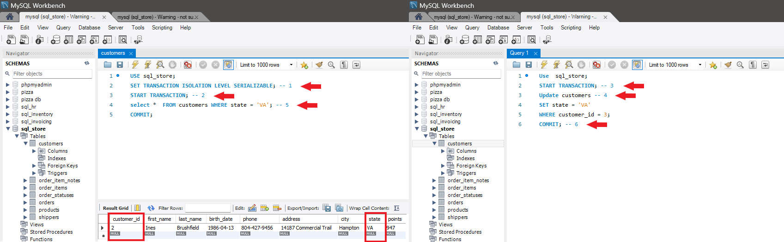
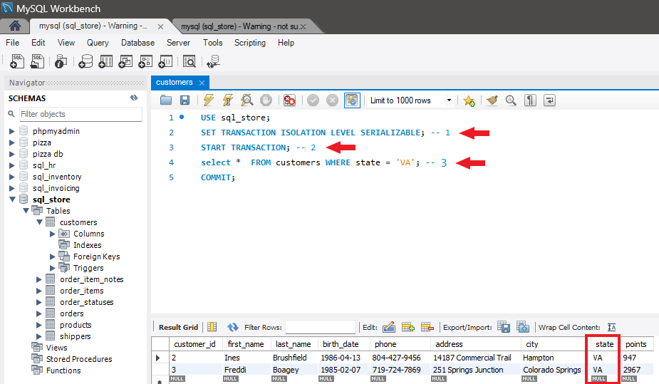

# SERIALIZABLE Isolation Level
The SERIALIZABLE isolation level in MySQL ensures that transactions are executed serially, one after another, with no overlapping execution. It provides the strongest data consistency guarantees by preventing all concurrency issues, including dirty reads, non-repeatable reads, and phantom reads. However, SERIALIZABLE may lead to increased contention and potential performance degradation due to its strict enforcement of transaction serialization.

### Characteristics of SERIALIZABLE
The SERIALIZABLE isolation level in MySQL has the following characteristics:

* **No Dirty Reads:** Transactions cannot read uncommitted changes made by other transactions, ensuring data consistency.

* **No Non-Repeatable Reads:** Transactions see the same values for the same data within the same transaction, preventing inconsistencies caused by concurrent updates.

* **No Phantom Reads:** Transactions cannot see additional rows inserted or deleted by other transactions within the same transaction, ensuring consistent query results.

### Advantages of SERIALIZABLE
The SERIALIZABLE isolation level offers the following advantages:

* **Strong Data Consistency:** Provides the highest level of data consistency guarantees by preventing all concurrency issues.

* **Predictable Results:** Ensures that transactions see a consistent and predictable view of the data, regardless of concurrent updates by other transactions.

### Disadvantages of SERIALIZABLE
The SERIALIZABLE isolation level has the following disadvantages:

* **Potential Performance Impact:** Enforcing strict transaction serialization may lead to increased contention and potential performance degradation, especially in high-concurrency environments.

* **Concurrency Limitations:** May limit the degree of parallelism and concurrency in the system, as transactions are executed serially.

### Setting SERIALIZABLE Isolation Level
You can set the SERIALIZABLE isolation level for a transaction in MySQL using the SET TRANSACTION ISOLATION LEVEL 
Example:

`Run these queries by commited order in two different sessions`

Query box 1
```sql
USE sql_store;
SET TRANSACTION ISOLATION LEVEL SERIALIZABLE; -- 1
START TRANSACTION; -- 2
select *  FROM customers WHERE state = 'VA'; -- 5
COMMIT;
```

```sql
Use  sql_store;
START TRANSACTION; -- 3
Update customers -- 4
SET state = 'VA'
WHERE customer_id = 3;
COMMIT; -- 6
```




# Check again


### Considerations and Best Practices
* **Use for Critical Transactions:** SERIALIZABLE is suitable for transactions that require the highest level of data consistency guarantees, such as financial transactions or critical business operations.

* **Monitor Performance:** Monitor database performance under SERIALIZABLE isolation, especially in high-concurrency environments, and optimize queries and transactions as needed.

* **Consider Alternatives:** Evaluate alternative isolation levels if the performance impact of strict transaction serialization becomes significant and compromises overall system performance.
<div style="display: flex; align-items: center; align-self: center; justify-content: space-evenly;" align="center">
<a href="../07_repeatable_read_isolation_level/"></a>
<a href="../readme.md"></a>
</div>