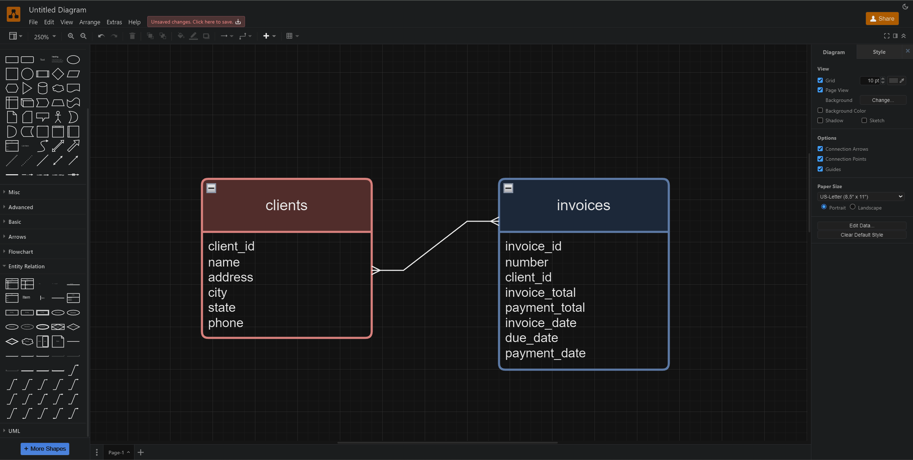

# Conceptual Models
A Conceptual Model is a simplified representation of a system or domain's structure, focusing on the main entities and their relationships. In the context of MySQL database design, a conceptual model outlines the key entities and their interactions without getting into implementation details.

### Purpose

* **Clarity:** Provides a clear understanding of the system's structure and requirements.
* **Communication:** Facilitates communication between stakeholders, including business users, designers, and developers.
* **Alignment:** Ensures that the database design aligns with the organization's goals and objectives.
* **Foundation:** Serves as the foundation for creating more detailed logical and physical models.

### Characteristics

* **Abstraction:** Focuses on essential entities and relationships without detailing attributes or implementation specifics.
* **Simplicity:** Presents a simplified view of the system, making it accessible to a wide range of stakeholders.
* **Flexibility:** Allows for changes and iterations as requirements evolve during the design process.

### Benefits of Conceptual Models

* **Clarity:** Provides a clear overview of the system's structure and requirements.
* **Alignment:** Ensures that the database design aligns with business goals and objectives.
* **Communication:** Facilitates communication between stakeholders by providing a common understanding of the system.
* **Simplicity:** Simplifies complex systems, making them easier to understand and manage.
* **Foundation:** Serves as the foundation for creating more detailed logical and physical models.

### Key Components
#### Entities
Entities represent real-world objects or concepts within the system. They serve as the building blocks of the conceptual model and are typically represented as rectangles in diagrams.

#### Relationships
Relationships define how entities are connected or interact with each other. They describe the associations between entities and are represented by lines connecting entities in diagrams.

### Creating a Conceptual Model
#### Requirements Gathering
Begin by gathering requirements from stakeholders to understand the system's functionality, data entities, and relationships.

#### Identifying Entities
Identify the main entities within the system, such as customers, orders, products, etc., based on the gathered requirements.

#### Establishing Relationships
Define the relationships between entities, including one-to-one, one-to-many, or many-to-many associations. These relationships capture how entities interact with each other.

### Tools and Resources

* [MySQL Workbench](https://www.mysql.com/products/workbench/)
* [Lucidchart](https://www.lucidchart.com/pages/?)
* [Draw.io](https://www.drawio.com/)

