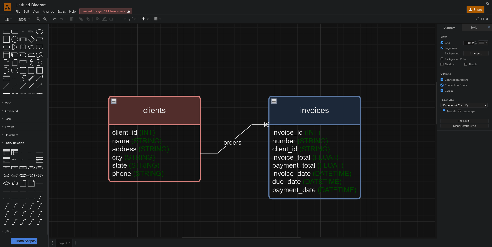

# Logical Models
Logical models define the structure of the database without specifying the implementation details specific to the MySQL database management system. They describe the entities, attributes, and relationships within the database, ensuring data integrity and efficient query performance.

### Concepts and Terminology
#### Entities
Entities represent real-world objects or concepts, such as customers, products, orders, etc., which will be stored in the database as tables.

#### Attributes
Attributes are the properties or characteristics of entities, defining the details that describe each entity.

#### Relationships
Relationships establish connections between entities, defining how they are associated with each other. Relationships can be one-to-one, one-to-many, or many-to-many.

#### Primary Keys
Primary keys uniquely identify each record within a table and ensure data integrity by enforcing uniqueness.

#### Foreign Keys
Foreign keys establish relationships between tables by referencing the primary key of another table. They enforce referential integrity and maintain data consistency.

#### Normalization
Normalization is the process of organizing data to reduce redundancy and dependency, ensuring data integrity. It involves dividing large tables into smaller, related tables and defining relationships between them.

### Creating Logical Models
#### Identifying Entities
Identify all relevant entities based on the requirements gathered during the analysis phase.

#### Defining Attributes
For each entity, define the attributes that describe its properties or characteristics.

#### Establishing Relationships
Determine the relationships between entities and specify the cardinality and optionality of each relationship.

