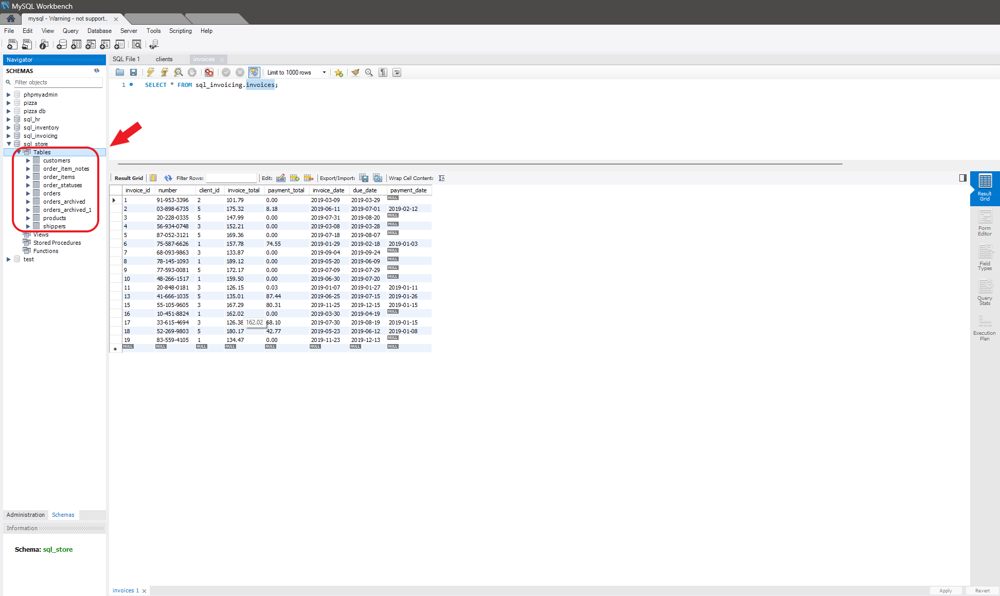
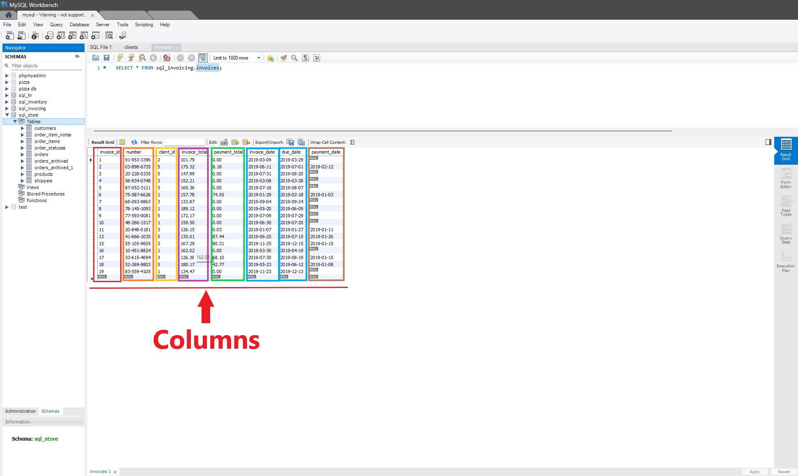

# Physical Models
MySQL Physical Models represent the concrete implementation of the database design, detailing how data is stored, indexed, and accessed within the MySQL database management system. Physical models define the tables, columns, indexes, constraints, and other elements necessary for translating the logical database design into a functional database schema.

### Physical Model Components
#### Tables
Tables are the fundamen tal structures for storing data in MySQL databases. They consist of rows and columns, where each row represents a record and each column represents an attribute of the record.

#### Columns
Columns define the attributes or fields of the data stored in a table. They have specific data types and may have additional properties such as default values, constraints, and indexing.

#### Data Types
MySQL supports a wide range of data types for storing different kinds of data efficiently, including numeric types, string types, date and time types, and other specialized types like JSON and spatial data types.

#### Indexes
Indexes are used to optimize data retrieval operations by providing quick access to data based on specific columns or expressions. They improve query performance by reducing the need for full table scans.

#### Constraints
Constraints enforce rules and relationships within the database schema to maintain data integrity. They include primary key constraints, foreign key constraints, unique constraints, and check constraints.

###  Design Considerations
#### Performance Optimization
Designing for performance involves optimizing data types, indexing strategies, query optimization, and database configuration to ensure efficient data retrieval and manipulation.

#### Storage Engine Selection
MySQL offers different storage engines, each with its own characteristics and performance trade-offs. Selecting the appropriate storage engine based on the requirements of the application is crucial for achieving optimal performance and scalability.

#### Partitioning
Partitioning involves dividing large tables into smaller, manageable partitions based on certain criteria such as ranges, lists, or hash values. It improves query performance, manageability, and availability by distributing data across multiple disks or servers.

#### Denormalization
Denormalization is the process of adding redundant data to a database schema to improve query performance by reducing the need for joins and aggregation. It is often used in read-heavy applications where query performance is critical.

###  Implementation in MySQL
#### Creating Tables
Tables are created using the `CREATE TABLE` statement, specifying the table name, column definitions, indexes, and constraints.

#### Defining Columns
Columns are defined with specific data types, lengths, and properties using the appropriate column definitions within the `CREATE TABLE` statement.

#### Adding Indexes
Indexes are added to tables using the CREATE INDEX statement or by specifying index definitions within the `CREATE TABLE` statement.

#### Applying Constraints
Constraints are applied to columns or tables using the appropriate constraint definitions within the `CREATE TABLE` statement or by using the `ALTER TABLE` statement to modify existing tables.

###  Data Types in MySQL
MySQL provides a variety of data types to accommodate different types of data efficiently, including numeric types, string types, date and time types, and other specialized types.

###  Indexes and Performance
Indexes play a crucial role in optimizing query performance by providing quick access to data. Proper indexing strategies should be employed to ensure optimal query performance.

###  Constraints
Constraints enforce rules and relationships within the database schema to maintain data integrity. Primary key constraints, foreign key constraints, unique constraints, and check constraints are commonly used in MySQL databases.

###  Storage Engines
MySQL offers several storage engines, each with its own features and performance characteristics. InnoDB, MyISAM, Memory, and other storage engines provide different capabilities for managing data.

###  Partitioning
Partitioning is a technique used to divide large tables into smaller, more manageable partitions based on certain criteria. MySQL supports various partitioning methods, including range, list, hash, and key partitioning.

###  Denormalization
Denormalization involves adding redundant data to a database schema to improve query performance. It is often used in read-heavy applications where query performance is critical and the overhead of joins and aggregations is undesirable.

