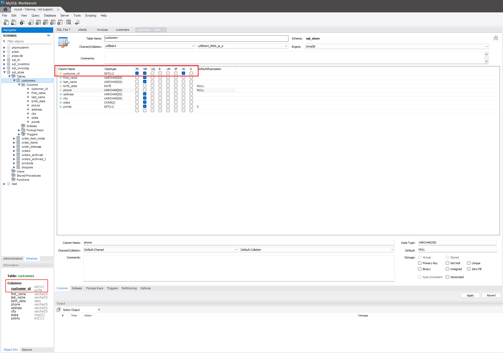

# Primary Keys
A primary key is a column or a set of columns in a table that uniquely identifies each row in that table. It ensures that no two rows have the same primary key value.

### Importance
Primary keys are crucial for maintaining data integrity, enabling efficient indexing, and facilitating relationships between tables through foreign keys.

### Uniqueness and Non-nullability
Primary key columns must contain unique values and cannot contain NULL values. These constraints ensure the reliability and integrity of the data.

###  Types of Primary Keys
**Single-Column Primary Keys**
A single-column primary key uses one column to uniquely identify each row. This is the most common type of primary key.

**Composite Primary Keys**
A composite primary key uses two or more columns to uniquely identify each row. Composite keys are used when a single column is insufficient to ensure uniqueness.


### Creating Primary Keys

**Creating Primary Keys on New Tables**
Primary keys are defined using the PRIMARY KEY constraint within the CREATE TABLE statement.

```sql
CREATE TABLE customers (
    customer_id INT(11) AUTO_INCREMENT,
    first_name VARCHAR(50),
    last_name VARCHAR(50),
    birth_date DATE,
    phone VARCHAR(50),
    address VARCHAR(50),
    city VARCHAR(50),
    state CHAR(2),
    points INT(11),
    PRIMARY KEY (customer_id)
);
```

**Adding Primary Keys to Existing Tables**
Primary keys can be added to existing tables using the ALTER TABLE statement.

```sql
ALTER TABLE customers ADD PRIMARY KEY (customer_id);
```




<div style="display: flex; align-items: center; align-self: center; justify-content: space-evenly;" align="center">
<a href="../04_physical_models/"></a>
<a href="../06_foreign_keys/"></a>
</div>