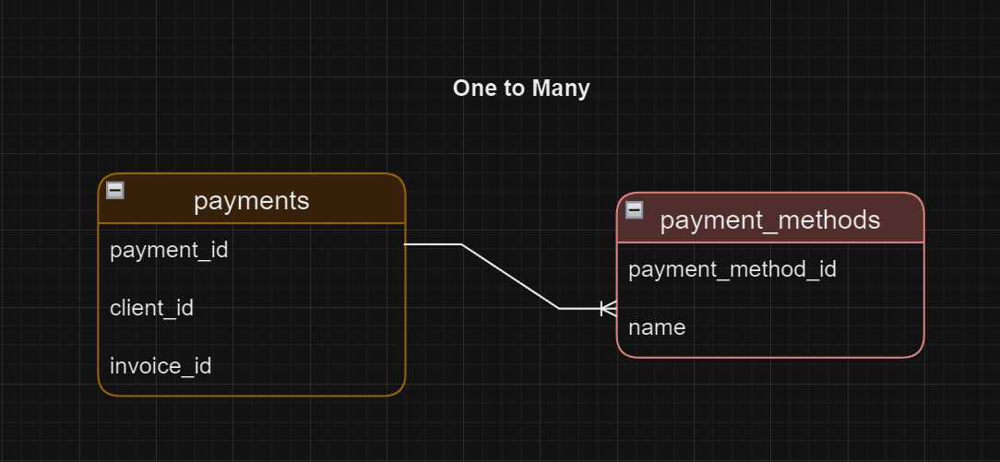
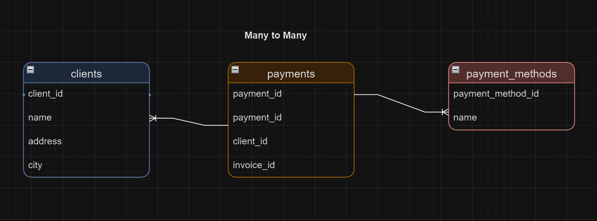

# Creating Relationships
Relationships in a database define how tables are connected to each other. They are crucial for maintaining data integrity and enabling complex queries. MySQL uses foreign keys to enforce relationships between tables.

### Types of Relationships
**One-to-One**
A one-to-one relationship occurs when a record in one table is related to a single record in another table. This type of relationship is less common and is used when you need to split data into two tables for performance, security, or organizational reasons.

**One-to-Many**
A one-to-many relationship is the most common type of relationship. It occurs when a record in one table can be related to multiple records in another table. For example, a single customer can place multiple orders.



**Many-to-Many**
A many-to-many relationship occurs when multiple records in one table are related to multiple records in another table. This is typically implemented using a junction table that contains foreign keys pointing to the primary keys of the related tables.




### Creating Relationships

**One-to-Many Relationship**

```sql
CREATE TABLE `payment_methods` (
  `payment_method_id` tinyint(4) NOT NULL AUTO_INCREMENT,
  `name` varchar(50) NOT NULL,
  PRIMARY KEY (`payment_method_id`)
);

CREATE TABLE `payments` (
  `payment_id` int(11) NOT NULL AUTO_INCREMENT,
  `client_id` int(11) NOT NULL,
  `invoice_id` int(11) NOT NULL,
  `date` date NOT NULL,
  `amount` decimal(9,2) NOT NULL,
  `payment_method` tinyint(4) NOT NULL,
  PRIMARY KEY (`payment_id`),
  KEY `fk_client_id_idx` (`client_id`),
  KEY `fk_invoice_id_idx` (`invoice_id`),
  KEY `fk_payment_payment_method_idx` (`payment_method`),
  CONSTRAINT `fk_payment_client` FOREIGN KEY (`client_id`) REFERENCES `clients` (`client_id`) ON UPDATE CASCADE,
  CONSTRAINT `fk_payment_invoice` FOREIGN KEY (`invoice_id`) REFERENCES `invoices` (`invoice_id`) ON UPDATE CASCADE,
  CONSTRAINT `fk_payment_payment_method` FOREIGN KEY (`payment_method`) REFERENCES `payment_methods` (`payment_method_id`)
);

```


**Many-to-Many Relationship**

```sql
CREATE TABLE `payment_methods` (
  `payment_method_id` tinyint(4) NOT NULL AUTO_INCREMENT,
  `name` varchar(50) NOT NULL,
  PRIMARY KEY (`payment_method_id`)
);


CREATE TABLE `invoices` (
  `invoice_id` int(11) NOT NULL,
  `number` varchar(50) NOT NULL,
  `client_id` int(11) NOT NULL,
  `invoice_total` decimal(9,2) NOT NULL,
  `payment_total` decimal(9,2) NOT NULL DEFAULT '0.00',
  `invoice_date` date NOT NULL,
  `due_date` date NOT NULL,
  `payment_date` date DEFAULT NULL,
  PRIMARY KEY (`invoice_id`),
  KEY `FK_client_id` (`client_id`),
  CONSTRAINT `FK_client_id` FOREIGN KEY (`client_id`) REFERENCES `clients` (`client_id`) ON DELETE RESTRICT ON UPDATE CASCADE
);

CREATE TABLE `payments` (
  `payment_id` int(11) NOT NULL AUTO_INCREMENT,
  `client_id` int(11) NOT NULL,
  `invoice_id` int(11) NOT NULL,
  `date` date NOT NULL,
  `amount` decimal(9,2) NOT NULL,
  `payment_method` tinyint(4) NOT NULL,
  PRIMARY KEY (`payment_id`),
  KEY `fk_client_id_idx` (`client_id`),
  KEY `fk_invoice_id_idx` (`invoice_id`),
  KEY `fk_payment_payment_method_idx` (`payment_method`),
  CONSTRAINT `fk_payment_client` FOREIGN KEY (`client_id`) REFERENCES `clients` (`client_id`) ON UPDATE CASCADE,
  CONSTRAINT `fk_payment_invoice` FOREIGN KEY (`invoice_id`) REFERENCES `invoices` (`invoice_id`) ON UPDATE CASCADE,
  CONSTRAINT `fk_payment_payment_method` FOREIGN KEY (`payment_method`) REFERENCES `payment_methods` (`payment_method_id`)
);

```


<div style="display: flex; align-items: center; align-self: center; justify-content: space-evenly;" align="center">
<a href="../13_creating_and_altering_tables/"></a>
<a href="../15_altering_primary_and_foreign_key_constraints/"></a>
</div>