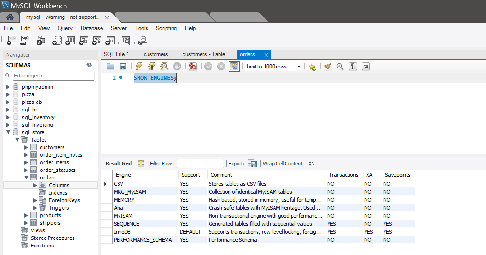

# Storage Engines
A storage engine is a software module that MySQL uses to create, read, update, and delete data from a database. MySQL supports multiple storage engines, each with its own strengths and use cases. The choice of storage engine can significantly impact the performance, reliability, and scalability of your database.

# Types of Storage Engines
**InnoDB**
InnoDB is the default storage engine in MySQL. It provides ACID-compliant transactions, foreign key support, and row-level locking, making it suitable for high-reliability and high-performance applications.

**MyISAM**
MyISAM is a non-transactional storage engine that offers fast read operations and full-text indexing. It is suitable for read-heavy workloads where transaction support is not required.

**MEMORY**
The MEMORY storage engine stores data in memory, providing very fast access times. It is useful for temporary tables and quick lookups, but data is lost when the server is restarted.

**CSV**
The CSV storage engine stores data in comma-separated values (CSV) files. It is useful for data exchange and interoperability with other applications.

**ARCHIVE**
The ARCHIVE storage engine is designed for storing large amounts of infrequently accessed historical data. It offers high compression and efficient storage.

**Other Engines**
MySQL supports additional storage engines, such as FEDERATED, BLACKHOLE, and NDB (Cluster), each with specific use cases and features.

# Default Engine
The default storage engine in MySQL is InnoDB. You can change the default storage engine by setting the default_storage_engine parameter in the MySQL configuration file:

```ini
[mysqld]
default_storage_engine = InnoDB
```
To check you default engine:

```sql
SHOW ENGINES;
```

# Per-Table Engine Selection
You can specify the storage engine for individual tables when creating or altering them:

```sql
ALTER TABLE customers
ENGINE=InnoDB;
```

# InnoDB Storage Engine

**Features**
* ACID-compliant transactions
* Foreign key support
* Row-level locking
* Automatic crash recovery
* Full-text search (starting from MySQL 5.6)

**Use Cases**
* High-reliability applications
* Applications requiring transaction support
* Complex queries and foreign key constraints

**Configuration Options**
* **innodb_buffer_pool_size:** Size of the buffer pool (memory) used for caching data and indexes.
* **innodb_log_file_size:** Size of each InnoDB log file.
* **innodb_flush_log_at_trx_commit:** Controls the flushing of logs to disk.

# MyISAM Storage Engine

**Features**
* Fast read operations
* Full-text indexing
* Table-level locking

**Use Cases**
* Read-heavy workloads
* Applications where transaction support is not required
* Full-text search applications

**Configuration Options**
* **key_buffer_size:** Size of the buffer used for index blocks.
* **myisam_sort_buffer_size:** Buffer used for sorting indexes during `REPAIR TABLE` or when creating indexes with `CREATE INDEX` or `ALTER TABLE`.

